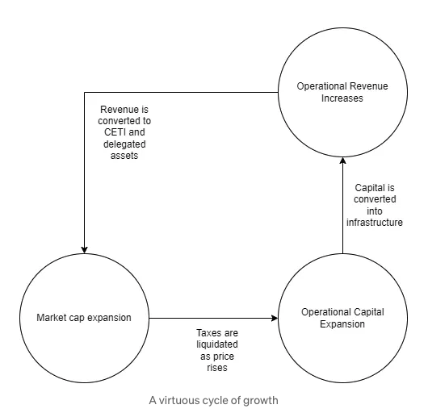

# The CETI token and ecosystem

The CETI token is the lifeblood of the ceτi AI ecosystem, designed to fuel the growth of decentralized AI infrastructure and reward community participation. The CETI tokenomics are designed to fund the expansion of our infrastructure and the development of decentralized AI networks and applications and to accrue the value of economically useful compute to token holders in a sustainable way while supporting both the Network and the broader adoption of decentralized AI technologies.

# CETI Token Allocation

90% (18,900,000 CETI) paired with wTAO at launch. 10% (2,100,000 CETI) Team tokens divided as follows: Half (1,050,000 CETI) for team and contributors vesting in Hedgey and/or Sablier, and half (1,050,000 CETI) for Team Operations fully vested.

# Our flywheel

Our tokenomics are designed to create a virtuous cycle of growth that powers the expansion of our infrastructure at a sustainable rate and support for decentralized AI. We start by capturing value from volatility in the form of taxes. This builds a treasury of tax reserves that are earmarked to be sold during times of market expansion.

As the market cap expands we will maintain a consistently increasing ratio of operational capital to high watermark market cap. Temporarily this increases the circulating supply and dilutes the revenue share but as this capital is converted into infrastructure it will generate proportionately more revenue per market cap due to economies of scale.

This capital is then converted into our intelligent infrastructure network by our team. As we expand our infrastructure the revenue per market cap should consistently outperform the previous high before the tax reserve liquidation.

As our infrastructure earns revenue it will be compounded back to an in-kind form of on-chain capital and distributed by our revenue share system. This creates buy pressure on the CETI asset which systematically applies pressure on the price.

This flywheel continues until there is no more economic value in expanding our infrastructure. The tax rate can be adjusted to ensure we never run out of taxes and can protect those in our revenue share system. If AI infrastructure is saturated then CETI has accomplished its mission.

# Revenue Share System

The revenue share system is how profits after operation expenses are returned to token holders. Our goal here is to identify different avenues for engagement that the project needs and to drive that engagement by pairing a higher share of the revenue to the things the project needs more of. An example above is that we will need delegated capital for various DePIN networks to pair with our infrastructure before it can be brought online. There will be other qualifying criteria that will evolve over time according to the project needs.

